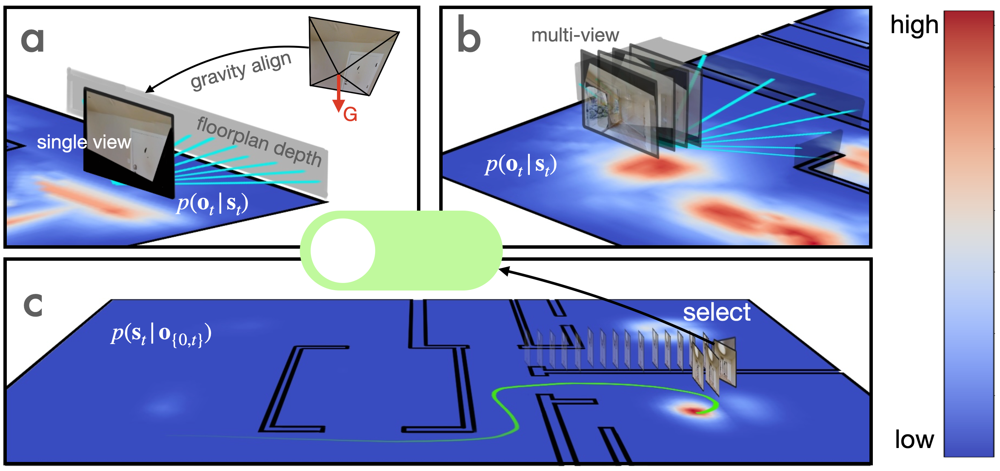

<div align= "left">
    <h1>F<sup>3</sup>Loc : Fusion and Filtering for Floorplan Localization [CVPR 2024 ✨highlight✨]
    </h1>
</div>


This repository contains the official implementation of the following paper:

> **F<sup>3</sup>Loc : Fusion and Filtering for Floorplan Localization**<br>
> Authors: Changan Chen, [Rui Wang](https://rui2016.github.io), [Christoph Vogel](https://www.microsoft.com/en-us/research/people/chvogel), [Marc Pollefeys](https://people.inf.ethz.ch/marc.pollefeys/)<br>
> [Paper](https://arxiv.org/pdf/2403.03370.pdf) | [arXiv](https://arxiv.org/abs/2403.03370) | [Project Page](https://felix-ch.github.io/f3loc-page/)

## Citation
If you use this project or ideas from the paper for your research, please cite our paper:
```
@inproceedings{chen2024f3loc,
  title={F $\^{3}$ Loc: Fusion and Filtering for Floorplan Localization},
  author={Chen, Changan and Wang, Rui and Vogel, Christoph and Pollefeys, Marc},
  booktitle={IEEE/CVF Conference on Computer Vision and Pattern Recognition},
  year={2024}
}
```

## Requirements
To get started with the code, clone this repository and install the required dependencies:
```bash
git clone https://github.com/felix-ch/f3loc.git
cd f3loc
conda env create -f environment.yml
conda activate f3loc
```

## Download Checkpoints
You can download the model checkpoints from [here](https://drive.google.com/drive/folders/1-TDlM9hjeODizeebgfPx7zWez0XPYCKm?usp=sharing).\
Place the logs folder under f3loc directory:
```
├── f3loc
│   ├── logs
│       ├── comp.ckpt   # checkpoint for the complementary network
│       ├── mono.ckpt   # checkpoint for the monocular network
│       ├── mv.ckpt     # checkpoint for the multi-view network
```

## Download Dataset
You can download the dataset from [here](https://libdrive.ethz.ch/index.php/s/dvKdj8WhmZuIaNw).\
The released Gibson Floorplan Localization Dataset contains three datasets <b>gibson_f</b>, <b>gibson_g</b> (four views of forward and geneneral motions) and <b>gibson_t</b> (long trajectories) as described in the paper.\
The data is collected in [Gibson Environment](https://github.com/StanfordVL/GibsonEnv).
For more detailed data organization please refer to the README of the dataset.

Place dataset under the data folder:
```
├── f3loc
│   ├── data
│       ├── Gibson Floorplan Localization Dataset
│           ├── README.md
│           ├── gibson_f
│               ├── ...
│           ├── gibson_g
│               ├── ...
│           ├── gibson_t
│               ├── ...
│           ├── desdf
│               ├── ...
```

## Usage
### Evaluate the observation models
```
python eval_observation.py --net_type <net-type> --dataset <dataset>
```
Specify the network type, and choose a dataset to evaluate on, you can use gibson_f or gibson_g, e.g.,
```
python eval_observation.py --net_type comp --dataset gibson_f
```
Help message for arguments can be listed by
```
python eval_observation.py -h
```
### Evaluate the sequential filtering
```
python eval_filtering.py --net_type <net-type> --traj_len <traj-len> --evol_dir <evol-dir>
```
This evaluates the sequential filtering with the proposed histogram filter on gibson_t. Choose a network type and specify the trajectory length. Set --evol_dir to a directory if you wish to dump the figures of likelihood and posterior evolution. By default the figures are not saved. E.g.,
```
python eval_filtering.py --net_type comp --traj_len 100 --evol_dir ./visualization
```
Check the usage of the arguments by
```
python eval_filtering.py -h
```
### Training
Our training script was specific for training on Azure ML. To ease customized
training, we provide a lightning wrapper for each module, in which the training
step and validation step are provided. To train the modules yourself, all you need
to do is ``trainer.fit()``. A short introduction can be found here [LIGHTNING IN 15 MINUTES](https://lightning.ai/docs/pytorch/stable/starter/introduction.html).
## Lincense
This project is licensed under the MIT License.